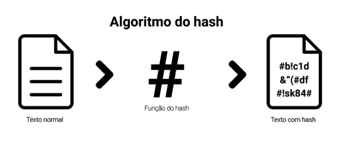

# Projeto de Desenvolvimento em Python
## | Objetivo principal

Desenvolver e aprimorar minhas habilidades com a tecnologia python.

## | O que é Criptografia?

A criptografia é como um segredo para suas mensagens. É uma técnica que torna informações ilegíveis para qualquer pessoa que não tenha a "chave" certa para desbloqueá-las.

## O que é Criptografia Hash?

A criptografia com hash é uma técnica que transforma informações em uma sequência de letras e números de tamanho fixo, chamada de "hash". Ela é como uma máquina que pega uma entrada (por exemplo, uma senha) e produz uma saída (o hash) que parece uma sequência aleatória de caracteres.

A principal característica de um algoritmo de hash é que ele sempre produz o mesmo hash para a mesma entrada. No entanto, é praticamente impossível reverter o processo para obter a entrada original a partir do hash. Isso torna os hashes úteis para armazenar senhas com segurança, verificar a integridade de arquivos e muito mais.

## | O projeto: Desafio Criptografia

O desafio foi lançado pela comunidade [Python Brasil](https://discord.com/channels/1142478776538763414/1155918502813773974/1155919159021011104), consiste num software que faça a criptografia e decriptografia de mensagens.

## | O que encontrarei nesse projeto?

* Duas versões do software supracitado.
    * [Versão 1](https://github.com/lucasgleria/desafiosPythonBrasil/blob/main/desafio2-criptografia/criptografia_v1.py)
        * Software em python puro.
        * Executa em linha de comando
    * [Versão 2](https://github.com/lucasgleria/desafiosPythonBrasil/blob/main/desafio2-criptografia/criptografia_v2.py)
        * Utiliza biblioteca PySimpleGUI
        * Executa em interface gráfica (GUI)

## | Tecnologias utilizadas

## | Equipe

* [Lucas Gomes Leria](https://www.linkedin.com/in/lucasleria/) - Desenvolvedor Fullstack